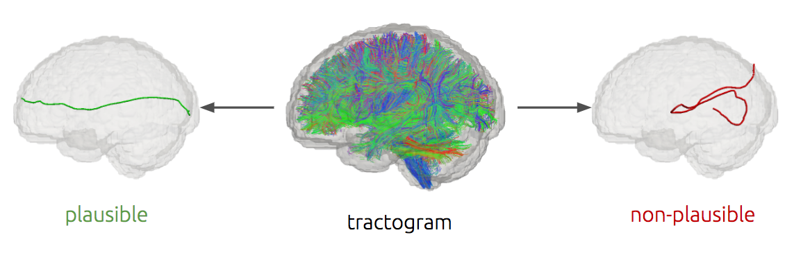

[](https://github.com/brain-life/abcd-spec)
[](https://doi.org/10.25663/brainlife.app.390)

# Tractogram Filtering
Filtering out of artifactual streamlines from a tractogram with a geometric deep learning model

### Description
This tool implements a method able to distinguish between anatomically plausible and anatomically non-plausible streamlines, based on the definitions given by Petit et al, 2019. The method is a geometric deep learning neural network presented at MICCAI2020 [1], which has been trained and tested on a dataset of 20 HCP subjects [https://doi.org/10.25663/brainlife.pub.13](https://doi.org/10.25663/brainlife.pub.13). 



##### input and output
- The input file is always a tractogram .trk, projected into MNI space with fixed number of points, 16, per streamline.
- The output file is again a tractogram .trk containing only the anatomically plausible streamlines.

### Authors
* Pietro Astolfi
* Paolo Avesani

### Funding Acknowledgement
brainlife.io is publicly funded and for the sustainability of the project it is helpful to Acknowledge the use of the platform. We kindly ask that you acknowledge the funding below in your publications and code reusing this code.

[](https://nsf.gov/awardsearch/showAward?AWD_ID=1734853)
[](https://nsf.gov/awardsearch/showAward?AWD_ID=1636893)
[](https://nsf.gov/awardsearch/showAward?AWD_ID=1916518)
[](https://nsf.gov/awardsearch/showAward?AWD_ID=1912270)
[](https://grantome.com/grant/NIH/R01-EB029272-01)

### Citations

1. Astolfi P. et al. (2020) Tractogram Filtering of Anatomically Non-plausible Fibers with Geometric Deep Learning. In: Martel A.L. et al. (eds) Medical Image Computing and Computer Assisted Intervention – MICCAI 2020. MICCAI 2020. Lecture Notes in Computer Science, vol 12267. Springer, Cham. https://doi.org/10.1007/978-3-030-59728-3_29
2. Avesani, P., McPherson, B., Hayashi, S. et al. The open diffusion data derivatives, brain data upcycling via integrated publishing of derivatives and reproducible open cloud services. Sci Data 6, 69 (2019). [https://doi.org/10.1038/s41597-019-0073-y](https://doi.org/10.1038/s41597-019-0073-y)

#### Distributed under MIT license. Copyright (c) 2020 Pietro Astolfi, Paolo Avesani

## Running the App 

### On Brainlife.io

You can submit this App online at [https://doi.org/10.25663/brainlife.app.390](https://doi.org/10.25663/brainlife.app.390) via the "Execute" tab.

### Running Locally (on your machine)

1. git clone this repo.
2. Inside the cloned directory, `git checkout miccai2020`
3. Create `config.json` with something like this:

```json
{
    "trk": "track.trk",
    "t1": "t1.nii.gz",
    "resample_points": true,
    "task": "classification",
    "return_trk": true
}
```

Here's the fields decription:
- `trk`: path to the tractogram uploaded by the user
- `t1`: path to the t1 image in subject space. The image is preferred if it is a brain extracted image. In case no t1 image is provided, the tractogram is assumed to be already in MNI space.
- `resample_points`: T/F flag. If T the streamlines will be resampled to 16 points, otherwise no.
- `return_trk`: T/F flag. If T the filtered trk tractogram will be returned along with the indexes of plausible and non-plausible streamlines.
- `task`: classification/regression. [not used right now]

4. Launch the App by using the desired `<tag>=cpu | gpu`:
* using Singularity: from a writable directory launch the following command:\
`singularity exec -e docker://pietroastolfi/tractogram-filtering:<tag> tractogram_filtering.py -config <path-to-json>`
<!-- - `$ sudo docker run --name tract_filtering -it pietroastolfi/tractogram-filtering:<tag> bash`\
`$ sudo docker exec docker://pietroastolfi/tractogram-filtering-cpu "tractogram_filtering.py -config <path-to-json>"` -->
* using Docker: `[sudo] docker run -v /home/<user>:/home/<user> --name tract_filtering -it pietroastolfi/tractogram-filtering:<tag> bash`


### Sample Datasets

We provide the dataset used in our experiment on Brainlife.io at [https://doi.org/10.25663/brainlife.pub.13](https://doi.org/10.25663/brainlife.pub.13)

In case you are interested in other datasets available on Brainlife.io you can directly download them, or you can use [Brainlife CLI](https://github.com/brain-life/cli).

```
npm install -g brainlife
bl login
mkdir input
bl dataset download 5a0e604116e499548135de87 && mv 5a0e604116e499548135de87 input/track
bl dataset download 5a0dcb1216e499548135dd27 && mv 5a0dcb1216e499548135dd27 input/dtiinit
```

## Output

All output files will be generated under the current working directory (pwd) inside `./tmp_tractogram_filtering/output/`

- `track_filtered.trk` : The input tractogram where artifactual streamlines has been filtered out. The output is in .trk format.
- `idxs_plausible.txt` : Txt file containing the indexes of anatomically plausible streamline with respect to the input tractogram.
- `idxs_non-plausible.txt` : Txt file containing the indexes of anatomically non-plausible streamline with respect to the input tractogram.

### Dependencies

This App only requires [singularity](https://www.sylabs.io/singularity/) to run. If you don't have singularity, you will need to install following dependencies inside a conda environment.  

via `conda install`:
- pytorch 1.5
- dipy 1.1
- mrtrix3 3.0

via `pip install`:
- antspyx 0.2.4
- torchviz
- tensorboardx
- pytorch-geometric 1.5 - see [https://pytorch-geometric.readthedocs.io/en/latest/notes/installation.html](https://pytorch-geometric.readthedocs.io/en/latest/notes/installation.html)
